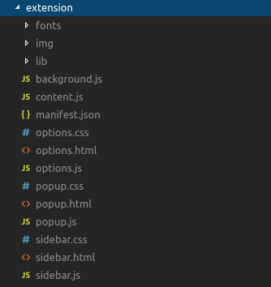

# Tax Butler - Chrome Extension

A Chrome Extension to help you download your Amazon and Paypal orders per page to a combined JSON or CSV file.

# Installation:
1. Download a release from Github.
2. Unzip it somewhere on your pc.
3. [Follow These Instructions from there](https://ui.vision/howto/install-chrome-extension-from-file) to install the unpacked extension.


# Usage:
## Amazon
1. Go to an Order page you want to take a snaphot of. 
2. Open the Extension, and click the `Process Amazon Page` Button to take a snapshot of it and save it to memory.
3. Continue until you have logged all the Order pages you want (yearly, monthly).
4. Click the `Update Catagories` button to make sure your Catagories per Order are nice and cleaned up.

## Paypal
1. Go to your Paypal Activity page 
2. Set up the date range you want to take a snaphot of.
3. Scroll down the page and click the `Show More` button or any button that will Show More entries. Keep clicking till all the Orders have loaded. 
4. Open the Extension, and click the `Process Paypal Page` Button to take a snapshot of it and save it to memory.
5. Wait. Depending on how many Orders you're trying to log, this may take a bit since the Butler will need to open each Order card and wait till loaded.
6. Click the `Update Catagories` button to make sure your Catagories per Order are nice and cleaned up.

## Exporting To JSON & CSV
Click any of the Download Buttons to download JSON & CSV files containg your Orders in the format of:

```json
{
 "Orders": [
    {
      "Category": "VideoGames",
      "Date": "May 1, 2021",
      "Items": [
        {
          "Category": "VideoGames",
          "Link": "https://www.amazon.com/gp/product/B0713WPGLL/ref=ppx_yo_dt_b_asin_title_o01_s00?ie=UTF8&psc=1",
          "Title": "WD 4TB Elements Portable External Hard Drive HDD, USB 3.0, Compatible with PC, Mac, PS4 & Xbox - WDBU6Y0040BBK-WESN"
        }
      ],
      "OrderId": "112-6514g9267-9141s0621",
      "Price": "$97.98",
      "User": "John Smith",
      "Vendor": "Amazon"
    },
    {
      "Category": "HomeOffice",
      "Date": "April 21, 2021",
      "Items": [
        {
          "Category": "HomeOffice",
          "Link": "https://www.amazon.com/gp/product/B073LHK99Z/ref=ppx_yo_dt_b_asin_title_o03_s00?ie=UTF8&psc=1",
          "Title": "AUSTOR 60-40 Tin Lead Rosin Core Solder Wire for Electrical Soldering (100g, 0.8mm)"
        }
      ],
      "OrderId": "112-52414gf777-9884267",
      "Price": "$8.70",
      "User": "John Smith",
      "Vendor": "Amazon"
    }]
    }

```
Clicking the `Download Combined JSON` button will yield both Amazon and Paypal orders combined. Use `var vendor = Orders[0].Vendor` or a similar format to reference the vendor.

## Clear Cache
Clear the cache of your order data. Do it.
Make sure to do this on both the Paypal Activity page and Amazon Orders pages just in case.


Now for the React stuff to build it:


# React Extension Boilerplate for Chrome and Firefox

[ ](https://github.com/kryptokinght/react-extension-boilerplate/network/members)
[ ](https://github.com/kryptokinght/react-extension-boilerplate/issues)
[ ](https://github.com/kryptokinght/react-extension-boilerplate/stargazers)
[ ](https://github.com/kryptokinght/react-extension-boilerplate/watchers)
[](LICENSE)
[](https://github.com/kryptokinght/react-extension-boilerplate/pulls)

**Still in Development!**
<em>
  
  :zap: Are you trying to create a **web Extension** but still looking for a starting point? <br/>
  :zap: Do you want your extension to run in both Firefox and Chrome? <br/>
  :zap: Are you tired of repeteadly reloading your extension after every small change you make? <br/>
  :zap: Do you want to develop your exetension using modern technologies like **React, Webpack, Jest**? <br/>

</em>

<br/>

***We have a solution!***

React Extension Boilerplate is a modern web extension template for building 
Mozilla and Chrome extensions using ReactJS.

Allows smooth and fast development of extension using on-the-go loading, building, packaging and publishing on the most common browsers Chrome and Firefox.<br/>
Make changes to the source code and watch the extension implement these changes live in the browser.
<br/> 
Implements all the best Javascript practises with ESLint, Jest, React-StoryBook, Webpack and lots more. 

* Source: [https://github.com/kryptokinght/react-extension-boilerplate](https://github.com/kryptokinght/react-extension-boilerplate)


## Installation :checkered_flag:

Installing this boilerplate is as simple as cloning this repo in a new folder and start editing the source folder.

*Before you begin installing this project you need [**NodeJS**](https://nodejs.org/en/) and [**npm**](https://www.npmjs.com/get-npm) installed on your machine. Make sure to install the latest version of node.*

```bash
# clone the git repo
$ git clone https://github.com/kryptokinght/react-extension-boilerplate.git

# Install dependencies
$ npm install
```

## Development :computer:

* Run script
```bash
# build files to './dev' 
# and launches the web ext in a new chrome instance, watches for changes and updates
$ npm run start:chrome
# launches in firefox
$ npm run start:firefox
# runs storybook
$ npm run storybook
```
*`npm run chrome-launch` in action:*


* If you want to load your unpacked extension by yourself, then run `npm run dev`. This will create the extension inside an **dev** folder in `development` mode and will watch the `src` folder for changes.   
* [Load unpacked extensions](https://developer.chrome.com/extensions/getstarted#unpacked) with `./dev` folder. Though you have to reload the extension by yourself every time the `./dev` folder updates.

*Screenshot of the development folder:*
<br/>


**Go to the project folder and run the following commands:** 

## How to develop extension using the boilerplate

The [CODETOUR.md](CODETOUR.md) gives an overview of the project structure.
<br/>
The only folder important to you is the **source folder**. The [`/src`](src) contains the different components of the extension like **content_scripts, background, options, popup, sidebar**. 

Any component which you not require, suppose you don't need *sidebar*, you can simply delete that component from the src folder and it will not be included inside your build.

### If you don't want to use React..

Suppose you don't want to use React in your [popup](src/popup) to develop UI. You can delete all the files inside the popup folder **only leaving** the [**`template.html`**] inside it. <br/>
You can use this `template.html` as your `popup.html`. **BUT** any scripts or CSS files referenced inside this template.html should be put inside the `src/lib` folder.<br/>

#### [Example of an extension bootstrapped using React Extension Boilerplate that doesn't use React!](https://github.com/kryptokinght/react-extension-boilerplate-example)  

### Storing static assets like images, fonts

Separate folders have been provided to store these static assets. 
* `/src/img`
* `/src/fonts`
  
These assets are copied as it is to the build folder, just like the `/src/lib` folder.

### Delete unnecessary files from the boilerplate

Files like CODETOUR.md, CONTRIBTUING.md, README.md, LICENSE in case they are not relavant to your project. [Once the CLI tool is build](https://github.com/kryptokinght/react-extension-boilerplate/issues/4), it will help you scaffold the extension without including these unnecessary files.

If you need any further help regarding feel free to ask on our [Gitter community](https://gitter.im/react-boilerplate-extension/community) or create an issue.


## Build :wrench: :hammer:

```bash
# build files to './extension'
$ npm run build
```
*Once created here's what the extension folder looks like:*
<br/>



## Compress :nut_and_bolt: 

```bash
# compress build folder to {manifest.name}.zip and crx
$ npm run build
$ npm run compress -- [options]
```

#### Options

If you want to build `crx` file (auto update), please provide options, and add `update.xml` file url in [manifest.json](https://developer.chrome.com/extensions/autoupdate#update_url manifest.json).

* --app-id: your extension id (can be get it when you first release extension)
* --key: your private key path (default: './key.pem')  
  you can use `npm run compress-keygen` to generate private key `./key.pem`
* --codebase: your `crx` file url

See [autoupdate guide](https://developer.chrome.com/extensions/autoupdate) for more information.

## Features

## Contributing :tada:

To get an idea about the structure of the project, [read here](CODETOUR.md).
Contributions are highly welcome. Please take some time to read the guidelines mentioned here [contribute](CONTRIBUTING.md).

<div align="center">
  
</div>

## License

The code is available under the [MIT license](LICENSE).
